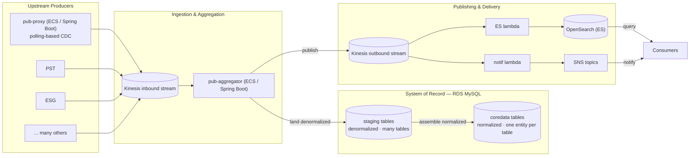
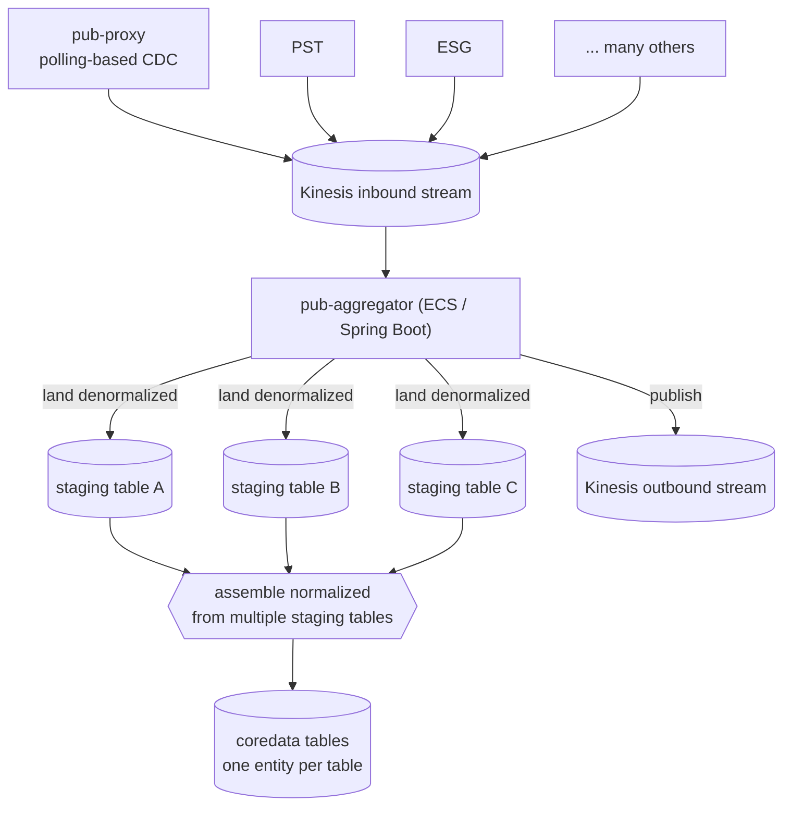
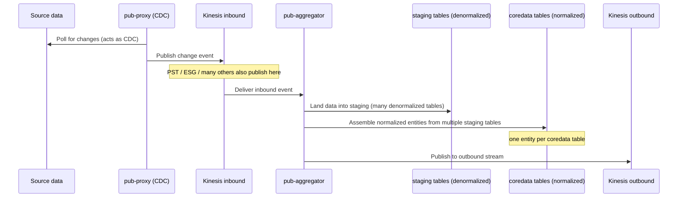
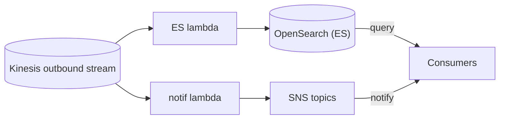
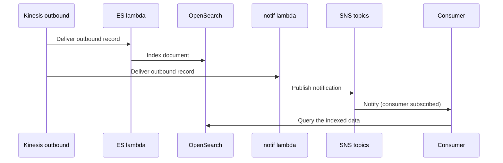
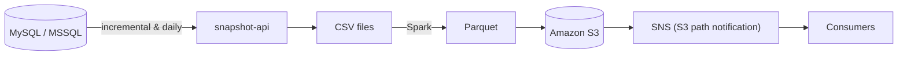
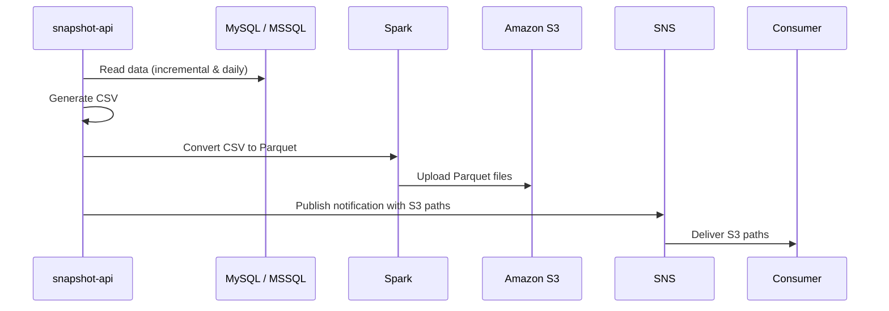

## CoreData Platform — Ingestion, Aggregation & Multi-Consumer Publishing

### Polling-Based CDC · Kinesis Fan-In / Fan-Out · Denormalized Staging → Normalized CoreData · Search & Notification Delivery

## Project Overview

The CoreData platform ingests financial data changes from multiple upstream sources, aggregates them into a canonical normalized store, and publishes them out to search, subscribers, and analytics — reliably and in near real time.

The platform is built from a few clearly separated flows:

- **Ingestion (fan-in)** — a polling-based CDC service and many other upstream producers feed a single inbound event stream
- **Aggregation** — a consumer lands data in **denormalized staging tables**, then assembles them into **normalized CoreData tables**
- **Publishing (fan-out)** — outbound events drive a search index and consumer notifications
- **Analytics** — a scheduled snapshot job publishes columnar data to a data lake for reporting

Each stage is an independently deployable service on its own failure domain, connected only through durable Kinesis streams.

## Business Context

Financial data changes originate in multiple upstream systems, and many downstream consumers need that data in different shapes — some need to **search** it, some need to be **notified** of every change, and some need **bulk snapshots** for analytics.

Rather than couple every producer directly to every consumer, the platform funnels all changes into a single **inbound stream**, aggregates them centrally into a normalized model, and then fans them back out through an **outbound stream**. This keeps producers and consumers decoupled and lets each side scale and fail independently.

Every day the platform handles:

- Change events from a **polling-based CDC** service plus **many upstream producers** (for example **PST**, **ESG**, and others)
- Central aggregation from **multiple denormalized staging tables** into **normalized CoreData tables**
- Near-real-time fan-out to a **search index** and **notification topics**
- Scheduled **snapshot exports** to a data lake for analytics

The platform had to stay highly available, keep ingestion decoupled from delivery, and let any single component fail without stopping the pipeline.

## System Overview

## Existing Challenges

Serving many consumers from many upstream sources was difficult because each side had different needs and cadences:

- **Many heterogeneous producers** (polling CDC, PST, ESG, and others) had to feed one consistent pipeline.
- Incoming data arrived in **denormalized** form and had to be reshaped into a **normalized** canonical model.
- Different consumers needed the same data in different ways — **searchable**, **push-notified**, or as **bulk snapshots**.
- Producers and consumers had to stay **decoupled** so neither could stall the other.
- Failures in any single component (a lambda, a consumer, the search index) could not be allowed to block ingestion.

## Architecture Approach

The platform funnels all change events into a single **Kinesis inbound stream** (fan-in), aggregates them in one place, and then republishes them through a **Kinesis**utbound stream** (fan-out) to independent delivery paths.

`pub-proxy` acts as the polling-based CDC producer; `pub-aggregator` is the single consumer that owns the write to the system of record and the handoff to the outbound stream. Everything downstream of the outbound stream — search indexing and consumer notification — is an independent, isolated path.

All services are **stateless containers on ECS**, connected only through durable streams, so scaling and recovery are routine and no component is tightly coupled to another.

## Ingestion & Aggregation Flow

Incoming events are first landed into **denormalized staging tables** (the staging schema can hold many such tables). The **normalized CoreData model is then assembled from multiple staging tables**, producing clean canonical entities — **one entity per CoreData table**. Once the normalized write is complete, the aggregator publishes to the outbound stream.

## Ingestion Sequence

## Publishing & Delivery Flow

Once `pub-aggregator` completes the normalized write, it publishes the change to the **outbound stream**, which drives two independent delivery paths:

- **ES lambda** indexes the record into **OpenSearch**, so consumers can query the data.
- **notif lambda** publishes to **SNS topics**, so subscribed consumers are notified that new data has arrived.

Consumers therefore receive data two complementary ways — a **push notification** via SNS, and a **queryable index** in OpenSearch.

## Delivery Sequence

## Key Engineering Decisions

#### Polling-based CDC via `pub-proxy`

`pub-proxy` polls the upstream source and emits change events, acting as a change-data-capture producer. This lets the platform ingest changes without the sources having to push directly to every downstream — the change stream becomes the shared contract.

#### Single inbound stream (fan-in)

Many producers — `pub-proxy`, PST, ESG, and others — publish to one **Kinesis inbound stream**. Consolidating producers behind a single stream keeps the aggregation logic in one place and decouples every producer from every consumer.

#### Denormalized staging → normalized CoreData

`pub-aggregator` first lands incoming data into **denormalized staging tables** — the staging schema can hold **many** tables. The **normalized CoreData model is then assembled by combining multiple staging tables** into clean canonical entities, with **one entity per CoreData table**. This two-step landing-then-normalize approach absorbs the varied shapes of many producers while keeping the canonical model consistent.

#### Outbound stream for fan-out

After the normalized write, `pub-aggregator` republishes to a **Kinesis outbound stream**. This cleanly separates *ingestion* from *delivery*: the outbound consumers (search, notification) evolve and fail independently of ingestion.

#### Lambda-based delivery

The outbound stream is consumed by lightweight, independently-scaling **lambdas** — one for search indexing (**ES lambda → OpenSearch**) and one for consumer notification (**notif lambda → SNS**) — so each delivery concern is isolated.

## Analytics — Off the Hot Path

Consumers also needed **bulk snapsh**s** of the data for analytics and reporting. Running large scans against the live transactional database would compete with production traffic, so snapshots are produced by a separate scheduled service.

`snapshot-api` reads from **MySQL / MSSQL** on both an **incremental** and a **daily** cadence, generates **CSV**, converts it to columnar **Parquet** using **Spark**, uploads the Parquet to **S3**, and then publishes an **SNS notification containing the S**paths** so consumers know exactly where to pick up the latest snapshot.

## Snapshot Flow

## Snapshot Sequence

## Design Decisions

### Decoupling through streams

Producers and consumers never call each other directly — they communicate only through the **inbound** and **outbound** Kinesis streams. This loose coupling lets each side scale independently and absorbs bursts without back-pressuring producers.

### Denormalized landing, normalized truth

Landing into **denormalized staging tables** lets the platform absorb the varied, source-shaped data from many producers without friction. Assembling the **normalized CoreData tables** from those staging tables then produces a clean, canonical model — one entity per table — that downstream delivery can rely on.

### Idempotent processing

Because stream delivery is at-least-once (retries and reprocessing can re-present records), the aggregator and lambdas are designed so that re-processing the same change is safe.

### Isolated delivery paths

Search indexing and consumer notification are separate lambdas on the outbound stream, so if one path (e.g. OpenSearch indexing) is degraded, the other (SNS notification) keeps working.

## Business Impact

The platform successfully enabled:

- **Unified fan-in** of many heterogeneous producers (polling CDC, PST, ESG, and others) into a single inbound stream
- **Central aggregation** from **multiple denormalized staging tables** into **normalized CoreData tables** (one entity per table) in RDS MySQL
- **Near-real-time fan-out** via an outbound stream to search (OpenSearch) and notifications (SNS)
- **Two complementary delivery modes** for consumers — push notification and queryable index
- **Resilient, idempotent, at-least-once processing** across the pipeline
- **Analytics at scale** via scheduled CSV → Parquet → S3 snapshots with S3-path notifications, fully isolated from the transactional path

The architecture kept producers and consumers decoupled through durable streams, allowing each stage to scale and fail independently while remaining easy to extend with new producers and delivery paths.

## Key Learnings

This project deepened my understanding of stream-based fan-in/fan-out design, landing denormalized data before assembling a normalized canonical model, and building delivery paths that stay independent and resilient.

More importantly, it reinforced that a durable stream as the integration backbone — with one place that owns aggregation and the write to the system of record — is what keeps a multi-producer, multi-consumer platform decoupled, recoverable, and simple to extend.