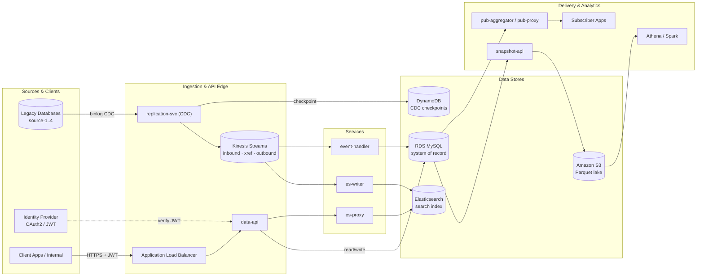
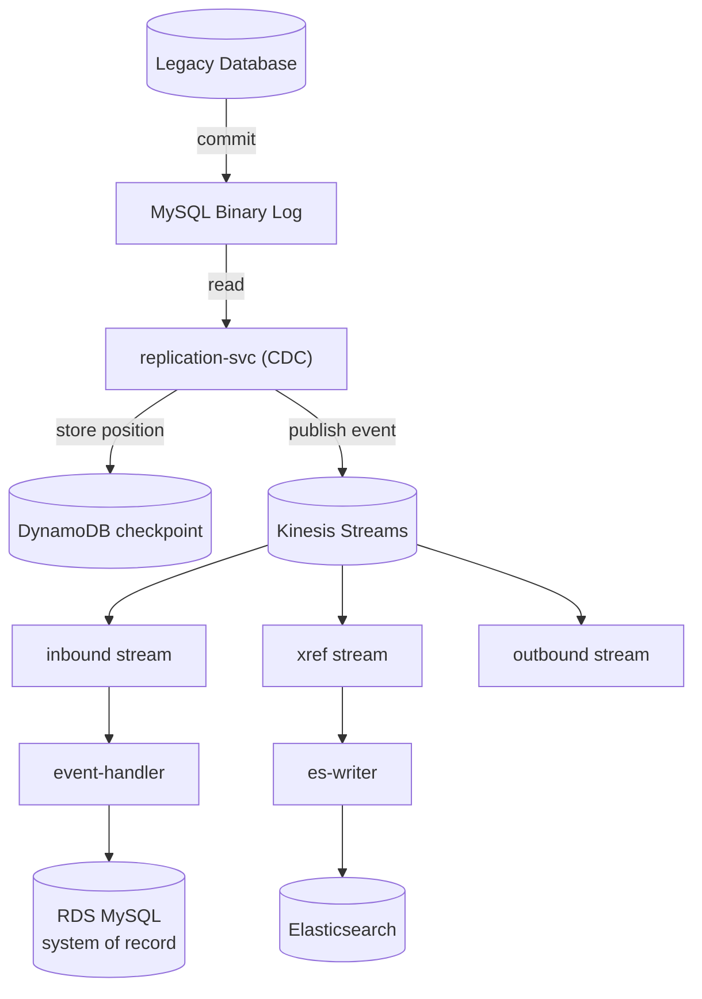
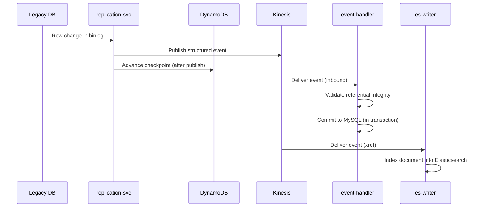
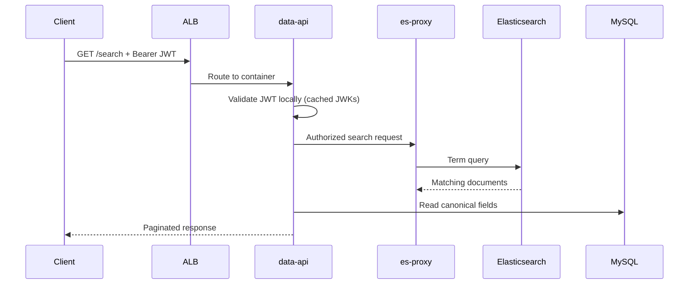
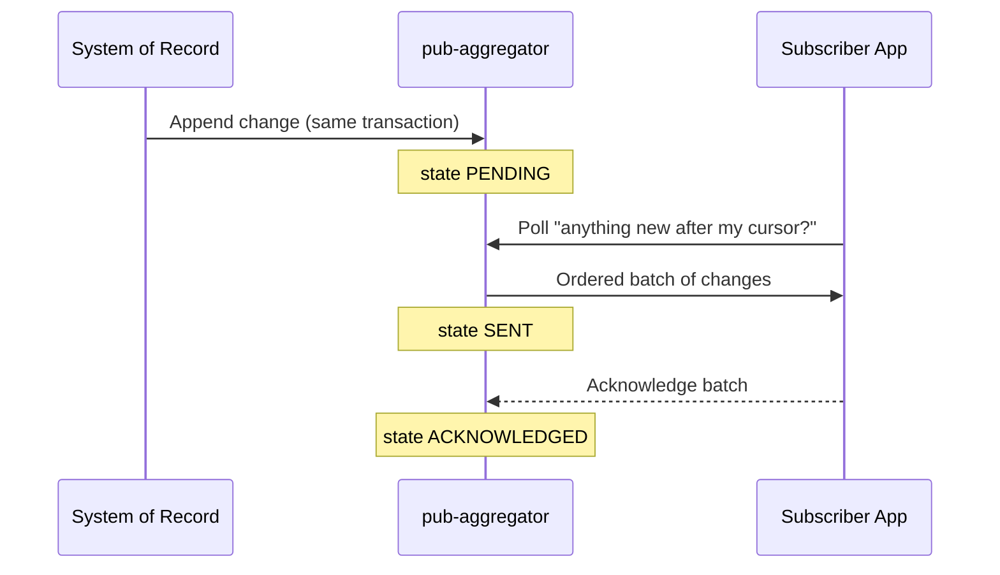

## Data Platform — CDC Ingestion & Real-Time Serving Architecture

### Change-Data-Capture Pipeline, Multi-Consumer Fan-Out & Zero-Downtime Evolution

## Project Overview

The Data Platform ingests changes from multiple legacy systems and serves them, in near real time, to internal clients, downstream subscribers, and an analytics estate — **without dual-write drift and without read-path outages**, even while the schema is evolving.

The platform is built from four independent flows:

- **Ingestion** — Change Data Capture (CDC) from the source-of-record database log into a durable event stream
- **Serving** — a JWT-secured REST API that reads the canonical store and a fast search index
- **Distribution** — a transactional outbox that delivers ordered change batches to external subscribers
- **Analytics** — a nightly columnar snapshot that keeps heavy reporting off the transactional path

Together these let clients read fresh data instantly, subscribers consume an ordered event feed, and analysts query the full dataset — each on its own failure domain.

## Business Context

The organisation ran **four legacy databases** as the systems of record, but consumers needed capabilities those databases could not serve directly: fast full-text search, an event feed for partner systems, and ad-hoc analytics over the whole dataset.

The naive approach — have every application **dual-write** to each downstream store — is a well-known trap: two writes across two systems are not atomic, so on any partial failure the stores drift apart silently and permanently.

Every day the platform handles:

- Change events from **four source systems**, captured in commit order
- Near-real-time propagation to a **search index** and to **downstream subscribers**
- Millions of read requests on the serving API
- A full analytical snapshot of the dataset for reporting

The platform had to remain highly available, keep the read path fast, and let any single component fail without taking the system down.

## System Overview

## Existing Challenges

Serving multiple consumers from legacy systems of record was difficult because each consumer had different needs, and the sources could not be changed:

- The legacy databases had to remain the **single source of truth** — no consumer could be allowed to become authoritative.
- Changes occurred continuously and had to be reflected downstream **almost immediately**.
- Multiple downstream systems depended on the **same** change data, at different speeds.
- Search required a **denormalised** representation the relational store could not serve efficiently.
- Analytics required **full-dataset scans** that would compete with production traffic if run against the live database.
- Any solution had to allow the schema to **evolve under live traffic** without an outage.

The platform needed to satisfy all of these while staying scalable and easy to extend for future consumers.

## Architecture Approach

Instead of asking every application to write to every downstream store, the platform captures **what was actually committed** to the source database (via its change log) and treats that stream as the single source of truth.

From there, changes **fan out** to independent consumers — each with its own checkpoint, its own deployment, and its own failure domain. One consumer materialises the canonical store, another builds the search index, another relays an event feed to subscribers.

Ingestion, serving, distribution, and analytics were separated into independent services so they could scale and fail independently. Every service is a **stateless container**, so scaling and recovery are routine.

## Change-Data-Capture Ingestion Flow

## Ingestion Sequence

## Real-Time Serving & Search

Persisting the change is only half the story. Clients needed fast reads and full-text search that the relational store could not provide efficiently.

Whenever a change flows through the stream, `es-writer` indexes a denormalised document into **Elasticsearch**. The serving API (`data-api`) reads canonical data from MySQL and delegates search to a thin authorisation gateway (`es-proxy`). Because search is populated by an **independent consumer**, the search index can be rebuilt from the stream at any time and can be down without ever blocking a write to the source of record.

## Serving Sequence

## Key Engineering Decisions

#### Change Data Capture as the single source of truth

Rather than dual-writing from applications, the platform reads the source database's binary log. This inherits the database's atomicity for free — we replicate exactly what was committed, in commit order — so the downstream stores can never silently diverge from the source.

#### Checkpointed, restart-safe ingestion

`replication-svc` records its binlog position in DynamoDB and only advances the checkpoint **after** publishing. If the service restarts, it resumes exactly where it left off — never losing a change, at worst re-publishing the last few (handled by idempotent consumers).

#### Durable event stream with replay

Kinesis provides a durable, ordered, retained event stream. Its retention window acts as a **replay buffer**: a consumer can be down for hours and simply catch up, and the search index can be fully rebuilt from the stream after an incident.

#### Independent, single-purpose consumers

Each downstream (`event-handler` → MySQL, `es-writer` → Elasticsearch, outbox → subscribers) is a separate consumer with its own checkpoint. This isolates failure domains — one downstream failing never blocks the others.

#### Stateless services on managed compute

Every service runs as a stateless container behind a load balancer, with all state pushed to managed stores. Scaling and recovery are boring by design, and infrastructure is defined as code so environments are reproducible.

## Distribution to Subscribers

External subscribers needed a reliable, ordered feed of changes — delivered even if a subscriber was temporarily offline.

The platform uses the **transactional outbox** pattern: change records are written to an outbox table in the *same* transaction as the business write, so the notification can never be lost or emitted for an uncommitted change. A relay tracks each change per consumer as `PENDING → SENT → ACKNOWLEDGED` and delivers ordered batches. A subscriber that was offline simply resumes from its cursor — downtime becomes lag, not data loss.

## Distribution Sequence

## Analytics — Off the Hot Path

Analysts needed full-dataset queries, but running large scans against the live transactional database would compete with production reads and writes.

A nightly **Spring Batch** job (`snapshot-api`) exports the source of record to columnar **Parquet** files on **S3**, which **Athena** queries directly. This keeps heavy analytical scans entirely off the OLTP path, and the columnar format makes those scans far cheaper than raw exports. The trade-off — analytics data is up to a day old — is deliberate and acceptable for reporting.

## Design Decisions

### Read/write separation (CQRS-style)

The relational store is the book of record; Elasticsearch is a denormalised read model for search. The platform accepts **eventual consistency** between them in exchange for search performance the relational store cannot provide.

### Idempotency everywhere

Because delivery is at-least-once (retries, replays, redelivery all re-present messages), every consumer is idempotent — deduplicating by change id or using upserts — so re-processing is always safe.

### Zero-downtime schema evolution

Schema changes use **expand / contract**: add the new shape, dual-write, backfill old rows, switch reads behind a flag, then drop the old shape last. Every step is backward-compatible, so the schema can evolve under live traffic with no outage.

## Trade-Offs That Give the Platform Its Edge

Every deliberate trade-off spends *strong consistency or freshness* to buy *availability, isolation, and recoverability* — the right currency for a platform whose job is to keep serving when a component fails.

| Accepted | To gain | The edge it gives |
| --- | --- | --- |
| Eventual consistency between MySQL and Elasticsearch | Independent failure domains | Search can be fully down while writes to the source of record never stop; search rebuilds from the stream |
| More moving parts and write amplification (CDC + fan-out vs a simple dual-write) | Atomicity and replay | Stores can never silently diverge; stream retention turns any consumer outage into lag, not loss |
| Analytics data up to ~24h old (nightly snapshots) | Protection of the transactional path | Large analytical scans never compete with production; columnar Parquet makes them far cheaper |

The through-line: **capture what was actually committed, then fan out to isolated consumers.** That single decision is why the platform is atomic, replayable, and resilient.

## Business Impact

The platform successfully enabled:

- **Unified ingestion** from four legacy systems of record via change data capture, with no dual-write drift
- **Near-real-time search** kept fresh by an independent indexing consumer
- **Reliable, ordered distribution** to external subscribers via a transactional outbox with per-consumer cursors
- **Self-healing recovery** — restarted services resume from a checkpoint; offline subscribers catch up from the stream
- **Analytics at scale** on a columnar data lake, entirely isolated from the transactional path
- **Zero-downtime schema evolution** under live traffic using the expand/contract pattern

The architecture significantly improved maintainability by separating each consumer from the core ingestion pipeline, while allowing the platform to scale and add new consumers with minimal change.

## Key Learnings

This project deepened my understanding of change data capture, event-driven fan-out, and building systems that stay correct and available as they evolve.

More importantly, it reinforced that good architecture is less about picking technologies and more about picking the **one foundational decision** correctly — here, treating the committed change log as the single source of truth — and then letting every downstream benefit from atomicity, replay, and isolation. The trade-offs all point the same direction, which is what makes it a designed system rather than an accreted one.
